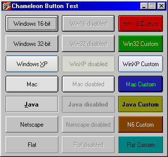



## CHAMELEON BUTTON \- An awesome multi\-style button

### Description

This is a multi-style command button to add to your applications. It can emulate seven different styles at a very accurate way!!! see the screenshot to belive... you will really be astonished. And the best of all: no external dll's or ocx's need to be used, an even the XP button is ownerdrawn!!! A must have for any coder. UPDATE!!! now it supports cool color changes!
 
### More Info
 

             |
---                |---
**Submitted On**   |2001-11-18 13:27:48
**By**             |[malachi](https://github.com/Planet-Source-Code/PSCIndex/blob/master/ByAuthor/malachi.md)
**Level**          |Advanced
**User Rating**    |4.8 (330 globes from 69 users)
**Compatibility**  |VB 5\.0, VB 6\.0
**Category**       |[Custom Controls/ Forms/  Menus](https://github.com/Planet-Source-Code/PSCIndex/blob/master/ByCategory/custom-controls-forms-menus__1-4.md)
**World**          |[Visual Basic](https://github.com/Planet-Source-Code/PSCIndex/blob/master/ByWorld/visual-basic.md)
**Archive File**   |[CHAMELEON\_3592111182001\.zip](https://github.com/Planet-Source-Code/malachi-chameleon-button-an-awesome-multi-style-button__1-28761/archive/master.zip)

